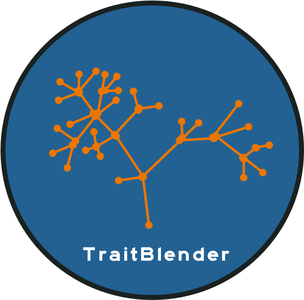

# TraitBlender



<p>
  This is the repo for TraitBlender, a Blender addon and workflow for simulating raw datasets. 
</p>

<p>
  Major work on this project began at <a href="https://github.com/Imageomics/Image-Datapalooza-2023/" target="_blank">Image Datapalooza 2023</a>, a workshop hosted by the 
  <a href="https://imageomics.osu.edu/" target="_blank">Imageomics Institute</a>. A major goal of the institute is to use Big Data and modern machine learning methods to better understand traits, such as phenotypes. However, many machine learning methods, such as neural networks, operate as "Black Boxes", making it difficult to understand 
  their results and interpret their decisions. This problem is compounded by the fact that phenotypes themselves are often quite complex, and are often constructed and used
  differently by different researchers.
</p>
<p>
  The decouple these different sources of confusion, we introduce TraitBlender, and Blender addon and workflow for simulating raw datasets under known processes. By raw 
  data, we mean images and 3D models of simulated taxa. 
</p>
<p>
  There have long-been established software ecosystems for simulating tabular data under imaging evolutionary processes, such as the <a href="https://cran.r-project.org/web/packages/ape/index.html"><i>ape</i></a> or <a href="https://cran.r-project.org/web/packages/phytools/index.html"><i>phytools</i></a> packages in R. These
  packages have empowered many researchers who develop models to test those models under common assumptions. As far as we know, however, no such accessible 
  ecosystem previously existed for generating images are 3D models under these processes.
</p>

####Rest in progress


### Docker
The following commands need to be run from the base directory of this repo.

#### Build
```
docker build -t traitblender .
```

#### Run
On Linux or Mac
```
mkdir results
docker run -v $(pwd)/results:/src/TraitBlender/results -it traitblender
```
On Windows you will need to replace `$(pwd)` with your current directory.
When the above command completes check the `results` directory for images created.
